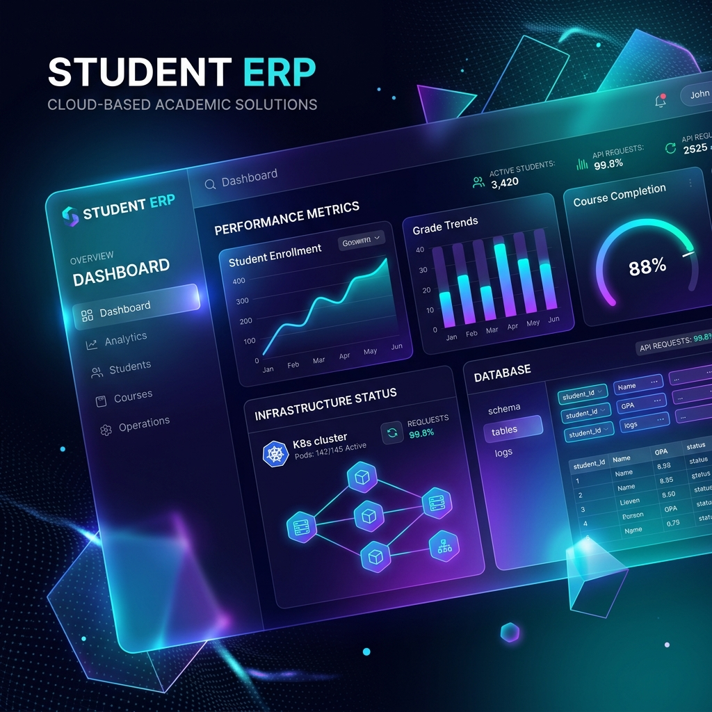
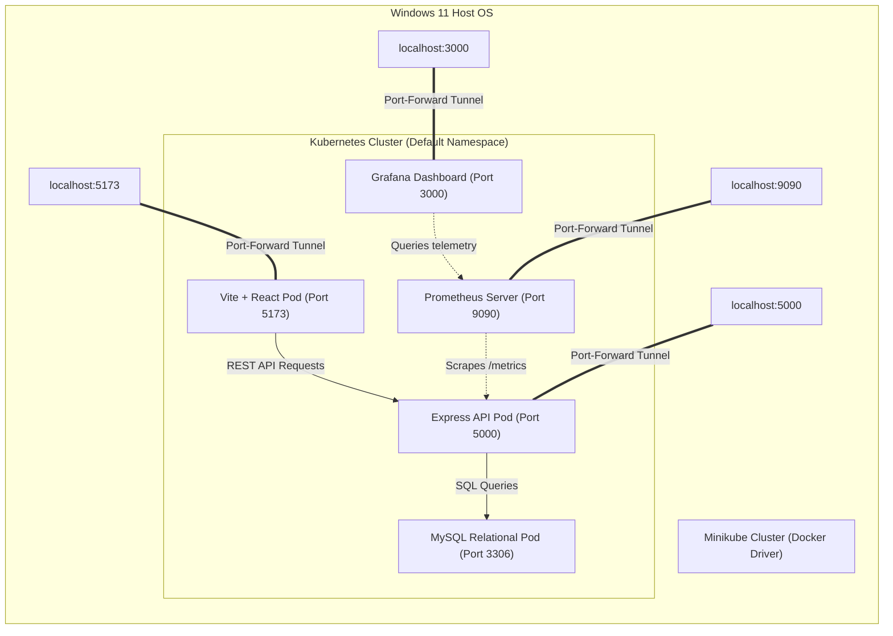
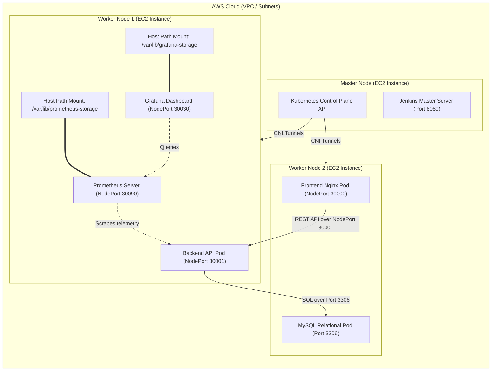
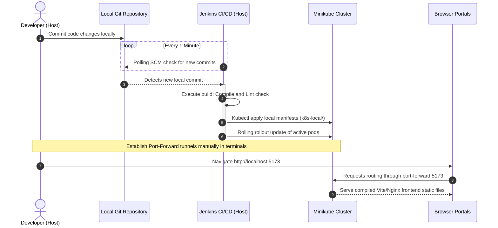
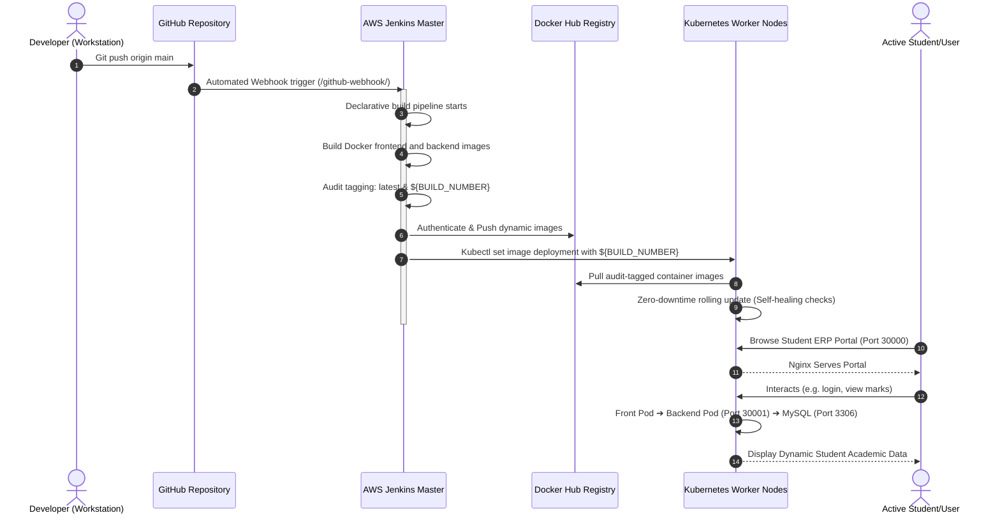

<div align="center">
  
</div>

<h1 align="center">Cloud-Based Student ERP System</h1>

<div align="center">


</div>

---

## 1. Executive Summary & Tech Stack

The legacy paper-and-spreadsheet institutional workflow has been re-engineered into a modern, 3-tier, highly-available, scalable, and fully observable cloud-native system. The system implements automatic self-healing containers, real-time observability dashboards, secure role-based access control, and a fully automated continuous integration and delivery (GitOps) pipeline.

### Core Technology Stack

* **Frontend UI Layer:** Built with **Vite + React 19**, Axios, and modern CSS. It features a responsive layout, beautiful glassmorphism aesthetic styling, dynamic dark mode, and context-aware dashboards for distinct roles.
* **Backend API Gateway:** Developed on **Node.js + Express** using the **MySQL2** relational driver, custom JWT authentication middlewares, Bcrypt secure password hashing, and active Prometheus metric instrumentation.
* **Database Layer:** A **MySQL Relational Database Engine** designed with strict transactional controls, primary-to-foreign key cascades, and data-integrity indexes.
* **Containerization & IaC:** Multi-stage production **Docker** configurations and **Terraform** plans provisioning AWS EC2 instances, security firewalls, and subnets.
* **Orchestration:** Multi-Node **Kubernetes** clusters running Calico CNI (Production) or Minikube running Flannel CNI (Local).
* **Automated CI/CD:** **Jenkins GitOps pipelines** providing declarative pipeline-as-code for static code validation, automated container compilation, security image tags, and zero-downtime cluster rollouts.
* **Telemetry & Observability:** A fully integrated **Prometheus & Grafana stack** with Node Exporter daemonsets, scraping telemetry endpoints, and displaying live CPU, RAM, and request load charts.

---

## 2. System Architecture & Working Diagrams

This section details both the static structural architectures and dynamic operational working flows for both the **Local Development Pipeline** and the **AWS Cloud Production Environment**.

---

### A. System Architecture Diagrams

#### 1. Local Development Architecture

This diagram displays the structural layout of the self-contained cluster environment running locally on the Windows 11 host using Minikube and Docker containers:



#### 2. Cloud Production Architecture

This diagram displays the multi-node infrastructure topology deployed on AWS using Terraform and Calico/Flannel CNI bridge filters:



---

### B. System Working & Interaction Flows

#### 1. Local Development Working Flow

This sequence chart outlines the developer interaction, local SCM checking, and automated port tunneling in your self-contained workspace:



#### 2. Cloud Production Working Flow

This sequence chart outlines the continuous GitOps lifecycle, automated Docker Hub tagging, and zero-downtime rolling update rollout on your AWS infrastructure:



---

## 3. Relational Database Schema Design

The institutional data layer is constructed inside the `student_erp` database schema (`database/init.sql`). It enforces referential integrity, unique index fields, and cascading behaviors across eight relational tables:

```
                  ┌──────────────┐
                  │    users     │
                  └──────┬───────┘
                         │ 1
                         ├────────────────────────────────────────┐
                         │ 1:1                                    │ 1:1
                         ▼                                        ▼
                  ┌──────────────┐                         ┌──────────────┐
                  │   students   │                         │   faculty    │
                  └──────┬───────┘                         └──────┬───────┘
                         │ 1                                      │
        ┌────────────────┼────────────────┐                       │
        │ 1:N            │ 1:N            │ 1:N                   │
        ▼                ▼                ▼                       │
 ┌──────────────┐ ┌──────────────┐ ┌──────────────┐               │
 │  attendance  │ │    marks     │ │    fees      │               │
 └──────────────┘ └──────────────┘ └──────────────┘               │
                                                                  │
                  ┌──────────────┐                                │
                  │ departments  │◄───────────────────────────────┘
                  └──────────────┘ 1:N
```

| Table Name | Description | Key Relationships & Integrity Constraints |
| :--- | :--- | :--- |
| **`users`** | Central registry containing usernames, roles, and Bcrypt hashed passwords. | **Primary Key**: `id` |
| **`departments`** | Represents institutional academic divisions (e.g., Computer Science). | **Primary Key**: `id`, Unique: `name` |
| **`students`** | Contains profile records for students linked to specific credentials. | **Foreign Key**: `user_id` ➔ `users.id` (ON DELETE CASCADE)<br>**Foreign Key**: `department_id` ➔ `departments.id` (ON DELETE SET NULL) |
| **`faculty`** | Contains teacher designations and profiles. | **Foreign Key**: `user_id` ➔ `users.id` (ON DELETE CASCADE)<br>**Foreign Key**: `department_id` ➔ `departments.id` (ON DELETE SET NULL) |
| **`attendance`** | Tracks daily subject-level attendance statuses ('present', 'absent', 'late'). | **Foreign Key**: `student_id` ➔ `students.id` (ON DELETE CASCADE) |
| **`marks`** | Grade book logging marks obtained, maximum potential marks, and semester. | **Foreign Key**: `student_id` ➔ `students.id` (ON DELETE CASCADE) |
| **`fees`** | Financial ledger detailing amount due, amount paid, status, and deadlines. | **Foreign Key**: `student_id` ➔ `students.id` (ON DELETE CASCADE) |
| **`notices`** | Institutional bulletin announcements visible to students and faculty. | **Foreign Key**: `posted_by` ➔ `users.id` (ON DELETE SET NULL) |

---

## 4. Local Development Pipeline (Self-Contained DevOps Workspace)

The local pipeline mirrors the production cloud setup by running a fully simulated Kubernetes cluster inside a local Windows environment without calling external cloud networks.

### Solved Local Pipeline Obstacles

* **SCM Polling Bypass:** Avoids public GitHub webhooks by configuring Jenkins to target the local workspace Git path directly, checking history every minute.
* **Local Checkout Permissions:** Configured Jenkins JVM permissions with `-Dhudson.plugins.git.GitSCM.ALLOW_LOCAL_CHECKOUT=true` inside `jenkins.xml` to authorize local directory pull commands.
* **Path Escaping in Git Bash:** Corrected backslash escapes inside Windows shell pipelines by forcing forward slashes in configuration environments (e.g., `KUBECONFIG` set to `C:/Users/<USER>/.kube/config`).
* **Compose Port Conflicts:** Cleared old Docker Compose container bindings off ports `5173` and `5000` to allow the Minikube network port-forward tunnels to hook successfully.

### Operational Step-by-Step Runbook

#### A. Cold Booting the DevOps Stack (From Scratch)

1. Launch the local Minikube cluster using Docker containers:

   ```bash
   minikube start --driver=docker
   ```

2. Apply the local application Kubernetes resources (MySQL, Backend, Frontend Configs):

   ```bash
   kubectl apply -f k8s-local/ --validate=false
   ```

3. Boot the local Prometheus & Grafana observability monitoring deployments:

   ```bash
   kubectl apply -f monitoring-local/
   ```

4. Verify that all cluster pods are successfully running and ready:

   ```bash
   kubectl get pods -n default
   ```

   *(Wait until all pods show `Running` and `1/1 READY` before proceeding.)*

5. Establish active network tunnels to open service gateways (run each in its own terminal):

   ```bash
   # Student ERP Web Portal Gateway
   kubectl port-forward service/frontend 5173:5173
   
   # Backend Express REST API Gateway
   kubectl port-forward service/backend 5000:5000
   
   # Grafana Observability Dashboard
   kubectl port-forward service/grafana 3000:3000
   
   # Prometheus Raw Metrics UI
   kubectl port-forward service/prometheus 9090:9090
   ```

#### B. Resuming Daily Work

If you previously stopped the stack using the cleanup script, Minikube was only suspended. To resume:

1. Reactivate the cluster:

   ```bash
   minikube start --driver=docker
   ```

2. Re-run your network port-forward commands (see Step 5 above). Do *not* re-run `kubectl apply` commands.

#### C. Stopping and Safe Workspace Pruning

At the end of your workday, run the targeted PowerShell script to clean up Docker containers and prune system assets without deleting configurations:

```powershell
.\cleanup-local.ps1
```

*(This halts Minikube, stops Compose, and prunes only Docker images containing the keyword `student-erp`, leaving unrelated images untouched).*

---

## 5. Production Cloud Infrastructure & DevOps Runbook

The production environment scales the system across a multi-node Kubernetes cluster hosted on **AWS EC2 instances** provisioned with **Terraform**. Code integration is automated using a Jenkins server configured with GitHub webhooks.

### Key Cloud Features & Strategies

* **Zero-Downtime Rollouts (declarative pipeline):**
  When pushing commits to GitHub, the Jenkins Server builds the frontend and backend Dockerfiles, tags them with the unique `${BUILD_NUMBER}` audit tag, pushes them to Docker Hub, and executes a rolling update rollout:

  ```bash
  kubectl set image deployment/backend backend=<DOCKER_HUB_USER>/student-erp-backend:${BUILD_NUMBER}
  kubectl set image deployment/frontend frontend=<DOCKER_HUB_USER>/student-erp-frontend:${BUILD_NUMBER}
  ```

  Kubernetes maintains active old pods until new pods pass their health checks, avoiding any user-facing downtime.

* **CNI Network br_netfilter Recovery:**
  Upon virtual machine reboots, Kubernetes pods are isolated and can fail to communicate. To resolve this, log into each node (Master, Worker 1, Worker 2) and enable CNI bridge filtering:

  ```bash
  ssh -i terraform/erp-cloud-key.pem ubuntu@<NEW_NODE_IP> "sudo modprobe br_netfilter && sudo sysctl net.bridge.bridge-nf-call-iptables=1"
  ```

  This restores intra-cluster Flannel/Calico network sandbox routing immediately.

* **Observability Data Persistence:**
  To prevent data loss on VM shutdowns, Grafana and Prometheus pods are pinned to Worker Node 1 using a Kubernetes `nodeSelector`. Their data directories are mounted to the host node's raw storage directories (`/var/lib/grafana-storage` and `/var/lib/prometheus-storage`), saving imported dashboards and historical metrics.

### Live Production Endpoints

Access the live cloud interfaces by replacing `<AWS_MASTER_IP>` with the master node IP:

* **Student ERP Web Portal:** `http://<AWS_MASTER_IP>:30000`
* **Backend API Gateway:** `http://<AWS_MASTER_IP>:30001`
* **Jenkins Automation Console:** `http://<AWS_MASTER_IP>:8080`
* **Grafana Dashboards:** `http://<AWS_MASTER_IP>:30030`
* **Prometheus Console:** `http://<AWS_MASTER_IP>:30090`
* **GitHub Webhook Payload URL:** `http://<AWS_MASTER_IP>:8080/github-webhook/`

---

## 6. Observability, Telemetry & Dashboards

A key DevOps requirement is total system observability. Real-time application performance monitoring is set up as follows:

1. **Express Telemetry Instrumentation:** The backend API leverages `prom-client` to capture raw system performance metrics. These are exposed internally on `/metrics`.
2. **Prometheus Scraping:** Prometheus scrapes target pods across the cluster at 15-second intervals via rules defined in `prometheus-config.yaml`.
3. **Grafana Dashboards:** Custom Grafana dashboards connect to Prometheus as a datasource.
   > [!TIP]
   > Import **Grafana Dashboard ID `1860`** inside your console to immediately load premium real-time dashboards mapping Node Exporter host telemetry (CPU usage, Memory pressure, network I/O, and active storage metrics).

---

## 7. Security & Defense-In-Depth

The student ERP system enforces strict security layers at every point in the stack:

* **Bcrypt Password Cryptography:** User passwords are never saved in cleartext. They are hashed using a salted **Bcrypt** algorithm (generating a 60-character secure hash) before being committed to the database.
* **JSON Web Token (JWT) Authentication:** API access is stateless and secured via signed JWT tokens. Tokens are configured with a strict **2-hour lifetime** to prevent session hijacking.
* **Role-Based Access Control (RBAC):** Users are assigned a role of `admin`, `faculty`, or `student`. Backend API routes verify the verified role inside the token payload before executing restricted controller operations.
* **Credential Abstraction:** Real passwords, database ports, and master secrets are never hardcoded inside repositories. They are decoupled and injected dynamically using **Kubernetes ConfigMaps** and environmental wrappers.

---

## 8. Directory Organization Map

The clean project structure mapping our services, infrastructure-as-code scripts, local configurations, and cloud plans is outlined below:

```
├── Jenkinsfile                    # Production GitOps CI/CD pipeline
├── Jenkinsfile-local              # Local GitOps testing pipeline
├── cleanup-local.ps1              # Local Docker/Minikube targeted clean script
├── docker-compose.yml             # Local service orchestration config
│
├── assets/                        # Document images and banner graphics
│   └── banner.png                 # Curated system banner
│
├── backend/                       # Node.js API Gateway Service
│   ├── Dockerfile                 # Slim production Node.js builder
│   ├── server.js                  # Express API, JWT middlewares, prom telemetry
│   └── seed.js                    # Database mock-data seeder
│
├── frontend/                      # Vite + React User Interface Portal
│   ├── Dockerfile                 # Optimized multi-stage React/Nginx builder
│   ├── vite.config.js             # Vite compiler config
│   └── src/                       # React components, router, and style assets
│
├── database/                      # Persistent Database Schema
│   └── init.sql                   # MySQL tables creation script and pre-seeds
│
├── k8s/                           # Production AWS Kubernetes Manifests
│   ├── mysql-configmap.yaml       # Injects DB name and credentials
│   ├── mysql-deployment.yaml      # Persistent Volume relational controller
│   ├── backend-deployment.yaml    # Node API pods replica controller
│   └── frontend-deployment.yaml   # Vite Nginx pods replica controller
│
├── k8s-local/                     # Local Cluster Minikube Manifests
│   └── (Manifests containing port mappings optimized for Minikube)
│
├── monitoring/                    # Production Prometheus & Grafana Manifests
│   ├── prometheus-rbac.yaml       # RBAC roles for metrics scraping
│   ├── prometheus-config.yaml     # Scrapes targets (/metrics endpoints)
│   └── grafana-deployment.yaml    # Grafana dashboard controller
│
├── monitoring-local/              # Local Prometheus & Grafana Manifests
│   └── (Observability configurations optimized for local Minikube ports)
│
└── terraform/                     # Infrastructure As Code
    ├── main.tf                    # Declares AWS cluster security group & 3 EC2 nodes
    └── .terraform.lock.hcl        # Locks validated AWS provider plugins
```

---

## 9. Master Port & Credentials Reference

### A. Portal Login Accounts

The database initializer pre-populates these demo accounts with the password `password123`:

* **Administrator Portal:** `admin_user`
* **Student Portal:** `student_john`
* **Faculty Portal:** `faculty_smith`

### B. Service Ports Table

| Service Port | Endpoint Target | Default Context |
| :--- | :--- | :--- |
| **`5173` / `30000`** | Student ERP Web Frontend UI | Local Minikube Tunnel / Production AWS NodePort |
| **`5000` / `30001`** | Express REST API Gateway | Local Minikube Tunnel / Production AWS NodePort |
| **`8080`** | Jenkins Automation Console | Local Host Port / Production NodePort |
| **`3000` / `30030`** | Grafana Performance Dashboard | Local Minikube Tunnel / Production AWS NodePort |
| **`9090` / `30090`** | Prometheus Metrics Engine | Local Minikube Tunnel / Production AWS NodePort |
| **`3306`** | Relational Database Engine | Internal Cluster MySQL Service Connection |
